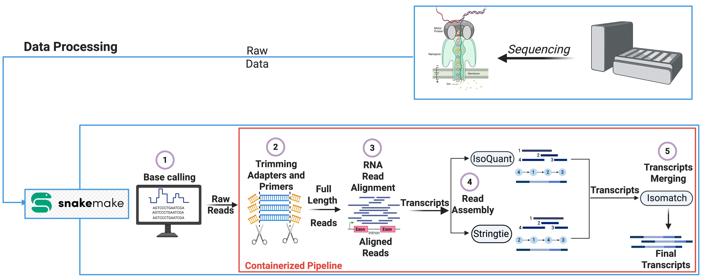

# NIA CARD Long-read RNA Sequencing Pipeline



A Snakemake pipeline for processing Oxford Nanopore Technologies (ONT) long-read
RNA sequencing data: read trimming, alignment, transcript assembly,
quantification, and optional transcript merging. It runs on the NIH Biowulf
cluster, generic SLURM clusters, and local workstations through a single
codebase with selectable execution profiles.

> **Note on basecalling:** Basecalling is currently supported on Biowulf only.
> On generic SLURM clusters and local workstations, the pipeline starts from
> pre-basecalled (unaligned) BAM files.

---

## Environments and Profiles

Select an execution profile when launching the pipeline:

```bash
./snakemake.sh <profile> [snakemake options]
```

| Profile   | Environment          | Starting point                     |
|-----------|----------------------|------------------------------------|
| `biowulf` | NIH Biowulf cluster  | POD5 (basecalling) or BAM          |
| `slurm`   | Generic SLURM HPC    | Pre-basecalled BAM                 |
| `default` | Local workstation    | Pre-basecalled BAM                 |

The profile is your choice; each one loads the appropriate modules or
environment for that system.

---

## Requirements

On the host system you only need:

- **Snakemake** (workflow engine)
- **Singularity/Apptainer** (containerized execution)

On Biowulf these are loaded automatically by the launcher. All pipeline tools
are bundled in a container that is pulled automatically on first run:

```
oras://quay.io/datatecnica/lrrna:1.2  ->  lrrna_1.2.sif
```

### Tools in the Pipeline

Processing:

- [Dorado](https://github.com/nanoporetech/dorado) — basecalling (Biowulf only)
- [Pychopper](https://github.com/nanoporetech/pychopper) — read trimming, rescue, and orientation
- [Minimap2](https://github.com/lh3/minimap2) — alignment
- [StringTie](https://github.com/gpertea/stringtie) — transcript assembly
- [IsoQuant](https://ablab.github.io/IsoQuant/index.html) — assembly and quantification
- **IsoMatch** — assembly merging and reannotation
- [gffcompare](https://github.com/gpertea/gffcompare) — transcript comparison

Quality control and reporting:

- [FastQ Screen](https://www.bioinformatics.babraham.ac.uk/projects/fastq_screen/) — contamination screening
- [samtools](https://www.htslib.org/) / [mosdepth](https://github.com/brentp/mosdepth) — alignment and coverage stats
- [cramino (nanopack)](https://github.com/wdecoster/nanopack) — long-read summary stats
- [RSeQC](https://rseqc.sourceforge.net/) and [RustQC](https://github.com/seqeralabs/rustqc) — RNA-seq QC metrics
- [MultiQC](https://multiqc.info/) — aggregated QC report
- [SIRVsuite](https://github.com/Lexogen-Tools/SIRVsuite) — SIRV spike-in QC
- [CARDlongread-report-parser](https://github.com/molleraj/CARDlongread-report-parser) — sequencing report parsing

---

## Quick Start

```bash
# 1. Clone and enter the pipeline directory
git clone https://github.com/NIH-CARD/CARDlongread_ONT_long_read_RNA.git
cd CARDlongread_ONT_long_read_RNA

# 2. Set reference paths in the config for your profile
#    biowulf -> config/biowulf.yaml
#    slurm   -> config/slurm.yaml
#    default -> config/default.yaml

# 3. Edit the sample sheet (input_example.txt)

# 4. Validate the workflow (dry run)
./snakemake.sh <profile> -n

# 5. Run
./snakemake.sh <profile>
```

On Biowulf, submit as a batch job:

```bash
sbatch snakemake.sh biowulf
```

---

## Assembly Modes

Set `assembly_mode` in your config file:

- **`discovery`** — assembles novel transcripts with IsoQuant and StringTie, then
  merges them with IsoMatch into a unified, reannotated GTF. Final per-sample
  output is an annotated GTF. This is the most common mode.
- **`quantification`** — reference-only estimation with no novel transcript
  models. Final per-sample outputs are IsoQuant transcript/gene count tables and
  the StringTie GTF. The merge step is not run in this mode.

---

## Input Data

### Biowulf (POD5, basecalling enabled)

POD5 files are expected under:

```
{sample_id}/{sample_id}/{flowcell_id}/pod5/
```

### Generic HPC / Local (pre-basecalled BAM)

Unaligned BAM files are expected under:

```
snakemake_test/ONT_UBAM/{sample_id}/{sample_id}_{flowcell_id}.bam
```

### Sample Sheet

Provide a tab-separated file with one sample per line and no header:

```
NABEC_KEN-1069_FTX_RNA	20250114_2319_2A_PAW72725_5119b730
NABEC_SH-05-16_FTX_RNA	20250114_2315_3D_PBA14601_3935a955
```

- **Column 1** — sample ID
- **Column 2** — flowcell ID

If you do not have a flowcell ID, any unique run label works in the second
column (for example an experiment name), as long as it matches your input file
names.

---

## Outputs

- Per-sample transcript and gene quantification tables (`.tsv`)
- StringTie transcript assemblies (`.gtf`)
- Merged, annotated transcript GTF per sample (discovery mode)
- MultiQC report summarizing run quality
